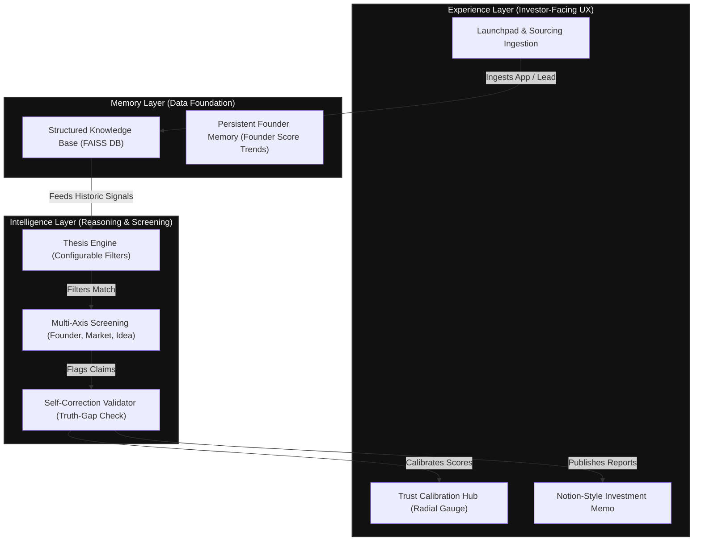
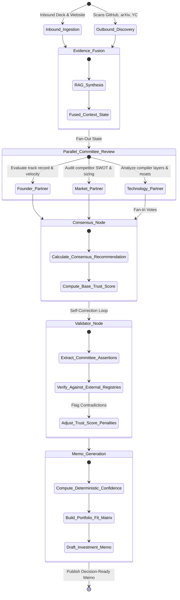

# 🤖 VC Brain: Multi-Agent execution & Data Flow Guide

This document provides a highly detailed walkthrough of the agentic graph, data transformations, and decision-making logic of the **VC Brain AI Operating System**. Use these diagrams and breakdowns for project presentations, pitches, or demo videos.

---

## 1. End-to-End Pipeline Overview

The pipeline strictly coordinates **Sourcing**, **Screening**, **Diligence**, and **Decision** across three system layers:

---

## 2. LangGraph Execution State Machine

The backend orchestrates analysis using **LangGraph**, enabling parallel analysis nodes (fan-out) followed by a centralized consensus validation and memo drafting stage (fan-in).

---

## 3. Step-by-Step Agentic Operational Flow

When you click **Analyze Startup**, the agents execute sequentially to maintain a verifiable audit trail:

### Step 1: Evidence Ingestion & Fusion
*   **Agent**: `evidence_fusion`
*   **Input**: Raw pitch deck text, website crawled text, and founder GitHub commits.
*   **Operation**: De-duplicates inputs and builds an enriched RAG context.
*   **Result**: Fused Context State.

### Step 2: Parallel Committee Scoring (Non-Averaged)
Three specialized partner agents evaluate the opportunity along independent axes:
1.  **Founder Partner Agent (`founder_partner`)**: Evaluates the founder's track record (previous exits, open-source commits, hackathon history) and references the persistent **Founder Score** from the Memory Layer.
2.  **Market Partner Agent (`market_partner`)**: Builds a SWOT matrix, analyzes size of the target addressable market, and scores competitive threats (`Bullish` / `Neutral` / `Bear`).
3.  **Technology Partner Agent (`technology_partner`)**: Investigates the code repositories and architectures for deep compiler-level optimizations.

### Step 3: Consensus Calculation
*   **Service**: `ConsensusService`
*   **Operation**: Evaluates the committee votes. Calculates the average recommendation (e.g., `APPROVE`, `REJECT`, or `FURTHER_DD`) and establishes the `base_trust_score`.

### Step 4: Validator Verification & Self-Correction
*   **Agent**: `validator`
*   **Operation**: Extracts all key claims (e.g. *"$800k ARR"*, *"Stanford CS graduate"*) and validates them against external vector records. 
*   **Penalization Rule**: If a contradiction is detected (e.g., claimed ARR is higher than Stripe telemetry records), the Validator Agent applies a penalty, calibrating the overall **Trust Score** downward and flagging the discrepancy for the investor.

### Step 5: Memo Generation & Portfolio Fit mapping
*   **Agent**: `investment_memo`
*   **Operation**: Computes final deterministic confidence based on validation coverage and source reliability. Maps the startup against existing investments to compute the **Portfolio Fit Radar Chart**, and drafts the final 12-section Notion-style Memo.
