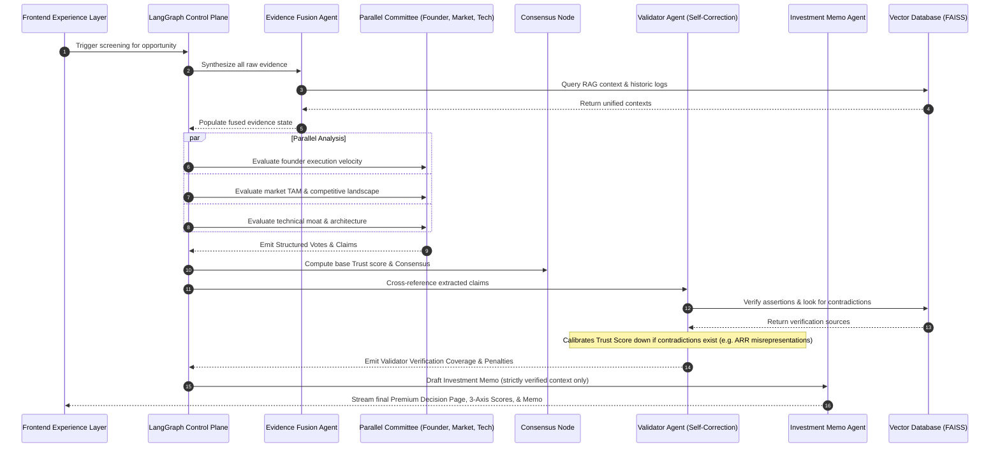

# The VC Brain: Deploying $100K Checks in 24 Hours
### Powered by Maschmeyer Group — Investing in Exceptional Founders

The **VC Brain** is an autonomous, data- and AI-first operating system designed to transform venture capital from a relationship-gated, slow-moving process into a merit-based, high-velocity intelligence engine. Built for the Hack-Nation Challenge, the system automates the end-to-end investment pipeline: **Sourcing ➔ Screening ➔ Diligence ➔ Decision-Ready Memos**.

---

## 🏗️ Architecture Overview

The system operates across three fundamental layers (Memory, Intelligence, Experience) that coordinate data collection, multi-axis reasoning, self-correction validator checks, and final investment outputs.

```mermaid
graph TD
    subgraph Sourcing Layer (Inbound + Outbound)
        A1[Inbound Pitch Deck / Application] --> B1[Intake Ingestion]
        A2[Outbound Scanners: GitHub, arXiv, YC] --> B2[Outbound Discovery Engine]
    end

    subgraph Memory Layer (Data Foundation)
        B1 --> C[Structured Knowledge Base]
        B2 --> C
        C --> D[(Persistent Founder Memory)]
        D -->|Surfaces Score & History| E[AI screening Funnel]
    end

    subgraph Intelligence Layer (LangGraph Multi-Agent System)
        E --> F[Evidence Fusion Node]
        F --> G1[Founder Partner Agent]
        F --> G2[Market Partner Agent]
        F --> G3[Technology Partner Agent]
        G1 --> H[Consensus Engine]
        G2 --> H
        G3 --> H
        H --> I[Validator Agent: Self-Correction Loop]
        I --> J[Investment Memo Agent]
    end

    subgraph Experience Layer (Investor-Grade UI)
        J --> K[Notion-Style Memo]
        J --> L[Bloomberg-Grade Analytics Dash]
        J --> M[Trust Calibration Hub]
    end
    
    style H fill:#2563EB,stroke:#2563EB,stroke-width:2px,color:#fff
    style I fill:#EF4444,stroke:#EF4444,stroke-width:2px,color:#fff
    style J fill:#22C55E,stroke:#22C55E,stroke-width:2px,color:#fff
```

---

## 🧠 LangGraph Agentic Workflow & Multi-Agent Flow

The core backend intelligence is powered by **LangGraph**, structuring execution as a stateful, parallel multi-agent graph. This ensures deterministic, repeatable reasoning rather than a simple sequential chat window.



### Specialized Agents & Roles
*   **Evidence Fusion Agent**: Merges fragmented signals (pitch deck, website crawl, GitHub commit history) into a unified context representation.
*   **Founder Partner Agent**: Evaluates leadership indicators, academic research paper count, and commits to establish a persistent **Founder Score**.
*   **Market Partner Agent**: Assesses total addressable market (TAM), runs competitor SWOT clustering, and rates the landscape (`Bullish`, `Neutral`, or `Bear`).
*   **Technology Partner Agent**: Audits structural design, codebases, and compiler layers to determine if the product has a proprietary moat.
*   **Validator Agent (Self-Correction Loop)**: Verifies claims made by committee partners against external records or registry databases. Flags contradictions and applies math-based trust calibration.
*   **Investment Memo Agent**: Generates a standardized 12-section Notion-style PDF/markdown memo based strictly on verified inputs.

---

## ⚡ Core Features & MVP Deliverables

### 1. Configurable Thesis Engine
Unlike static evaluators, investors can tailor the **Thesis Engine** on-the-fly:
*   Filter by **Sector** (AI Infrastructure, SaaS, Cyber), **Stage** (Pre-Seed, Seed, Series A), and **Geography**.
*   Configure check limits and target ownership sizes using interactive sliders.
*   The system filters, scores, and calibrates recommendations to fit the fund-specific constraints.

### 2. Multi-Attribute Natural Language Reasoning
Support for compound, conversational queries directly against the knowledge base:
*   *Example Query*: `"technical founder, Berlin, AI infra, enterprise traction, Stanford CS, no prior funding"`.
*   The system runs semantic vector search to retrieve matching candidates from memory.

### 3. Outbound Sourcing (Identify ➔ Activate ➔ Converge)
Allows pre-fundraising discovery:
*   **Identify**: Scans GitHub Trending, arXiv, YC, Product Hunt, and MIT/Stanford directory signals.
*   **Activate**: Crafts personalized cold outreach emails referencing the specific source trigger (e.g. *"We noticed your recent GitHub compiler optimization commit..."*).
*   **Converge**: Once activated, the candidate moves directly into the screening pipeline alongside inbound applications.

### 4. Independent Multi-Axis Screening
Every candidate is evaluated across three independent axes to ensure clarity:
*   **Founder**: Pedigree, track record, score trend (`Improving`, `Declining`, `Stable`).
*   **Market**: Rated as `Bullish` 🟢, `Neutral` 🟡, or `Bear` 🔴, sizing, and competitive SWOT.
*   **Idea vs. Market**: Assessing technical viability and team pivot potential.

### 5. Verifiable Trust Center & Validator Loop
Provides full accountability for every claim:
*   Tracks total verified claims, sources utilized, and flagged contradictions.
*   **Self-Correction**: Displays warning flags if stated metrics (e.g., claimed ARR) mismatch validated registry data.

---

## 🛠️ Technology Stack

*   **Backend**: Python, FastAPI, LangGraph, LangChain, FAISS Vector database.
*   **Frontend**: React, TypeScript, Vite, Tailwind CSS v4, Recharts, Framer Motion, Lucide Icons.
*   **Build Pipeline**: Vite with `@tailwindcss/vite` native CSS plugin and LightningCSS minifier.
